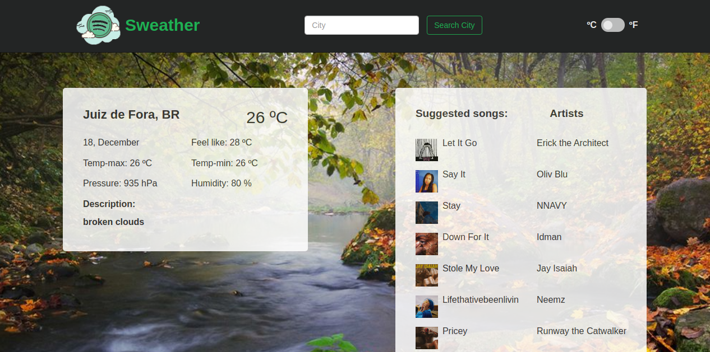

# Sweather

> A Javascript app that allows the user to look for the weather conditions anywhere in the world via OpenWeather's API and, depending on the weather, Spotify's API suggests a better playlist for your mood.



## Built With

- Javascript
- HTML
- CSS

## Live Demo

[Live Demo Link](https://sweatherapp.netlify.app/)

## Getting Started

To get a local copy up and running follow these simple example steps.

```
git clone https://github.com/abouhid/Weather_app.git
Open the index.html
Explore the website
```

## Authors

👤 **Alexandre Bouhid**

- Github: [@abouhid](https://github.com/abouhid)
- LinkedIn: [Alexandre Bouhid](https://www.linkedin.com/in/alexandrebouhid/)

## 🤝 Contributing

Contributions, issues and feature requests are welcome!

## Show your support

Give a ⭐️ if you like this project!

## 📝 License

This project is [MIT](lic.url) licensed.
